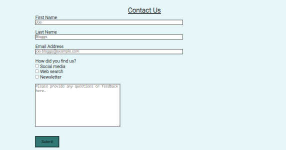

# Ivar the Boneless

This project website is dedicated to Ivar the Boneless. Ivar the Boneless is a historical figure within the heart of the Viking era of England, he was an influential figure that contributed greatly to the conquering of the north of England by the Vikings.

The website fictional website designed to educate its viewers on the timeline of the Viking invasion of England and Ivar the Boneless himself, it is purely educational in purpose and does not try to sell its viewers any form of product.

Visit the deployed website [here](https://charmungo98.github.io/project1-ivar-the-boneless/).

# 1. User Experience (UX)

### User Stories

- As an informational website, I want the website to have a dynamic and clear design that is easy to navigate.

- As an informational website, I want to present the information in a way that is simple to understand and accessible for all viewers.

- As an informational website, I want viewers to be able to find my social media links so they are able to subscribe to any future content that is produced.

- As a viewer, I want to be able to navigate the website intuitively and learn more about the informational topic displayed.

- As a viewer, I want to be able to find the information I need as easily and simply as possible, whilst enjoying a sleek and attractive website design.

- As a viewer, I want to easily find the contact information for the authors of the website.

- As a viewer, I want to find social media links to the owners of the website.

- As a viewer, I want to be able to be able to provide feedback to the authors of the website.

- As a viewer, I want to easily find links to further information on the topic in external locations that may add to my knowledge of the subject, such as wikipedia.

### Color Scheme

The colors used in the site are two different tones of blue (#317773 and #e4f6f8) and one tone of cream color (#FEFBEA). For the hover effects the two main blue and cream colors (#317773 and #FEFBEA respectively) were used, for all borders surrounding elements, black was used. These colors are chosen to create a dynamic and attractive display that draws in the viewer but does not distract from the content.

### Typogrophy

The main font being used in the site is Lugarismoy. Roboto is being used for the navbar, all H2 elements and footer elements, Roboto is also the main font used on the contact page.

### Wireframes

[Balsamiq](https://balsamiq.com/) has been used to showcase the appearance of the site and display the placement of the different elements whitin the pages.

# 2. Features

### General

- Responsive design across all device sizes.

- Similar color scheme and design throughout all pages to effectively structure, categorise and present the information to the viewers.

- Header

    - The header contains a nuetral background image and a responsive navigation bar positioned across the top of the screen.

    - The navigation bar is identical in all pages and contains links to all pages to facilitate navigation across the site. It also has a hover effect that changes color to provide feedback to the customer for a better user experience.

- Footer

    - The footer includes a smaller version of the logo and link to the business social media channels.

### Home Page

- Images

  - The images are design to attract the viewers attention and provide a more interattive experience when viewing the landing/viking timeline.

- Timeline content

  - Contains alternating text and image blocks with information about the timeline of the viking raids in England.

### Article Page

- Ivar the Boneless

    - The article page demonstrates a breif but detailed timeline of Ivar the boneless life and qualities, it is designed to keep the information compact and easy to understand to ensure its readers attention is kept.

    - An image of Ivar is displayed next to the article to provide a more dynamic article layout.

### Contact Page

- Contact Form

    - The form allows the viewers to provide feedback and ask questions directly from the website.

- About Us section

    - The about us section allows the user to learn a bit more about the developer/author and directs the viewer to the social media links in the footer.

# 3. Technologies Used

- [Google Fonts](https://fonts.google.com/ "Link to Google Fonts")
  - Google Fonts was used to import the fonts Raleway, Cabin and Qahiri into the style.css file. These fonts were used throughout the site.
- [Codeanywhere](https://app.codeanywhere.com/ "Link to Codeanywhere")

  - Codeanywhere was used for writing code, commiting, and then pushing to GitHub..

- [GitHub](https://github.com/ "Link to GitHub")

  - GitHub was used to store the project after pushing.

- [Responsive Design Checker](https://www.responsivedesignchecker.com/)
  - Responsive Design Checker was used in the testing process to check responsiveness on various devices.
- [Am I Responsive?](http://ami.responsivedesign.is/#)

  - Am I Responsive was used to check responsiveness of the site pages across different devices

- [W3C Markup Validator](https://validator.w3.org/)
  - W3C Markup Validator was used to validate the HTML code.
  -
- [W3C CSS Validator](https://jigsaw.w3.org/css-validator/)

  - W3C CSS Validator was used to validate the CSS code.

- [Chrome DevTools](https://developer.chrome.com/docs/devtools/)
  - Chrome DevTools was used during the development process to test, explore and modify HTML elements and CSS styles used in the project.

# 4. Testing

### Testing User Stories

- As a viewer I want to be able to navigate the website smoothly and further my lnowledge on the subject being displayed.

  - The website offers a intuitive structure for the viewers to navigate and find the information they are looking for.

  - The navigation bar is clearly presented in all pages for the viewers to find with ease and it is easily navigable.

- As a viewer, I want to easily find the contact information for the author of the webiste if I have any questions.

  - The footer and contact page contains a clear contact section with all necessary contacts, there is a feedback form on the contact page that allows the viewer to submit any questions or feedback they have.

- As a viewer, I want to find social media links to the author of the webiste.

  - The footer provides link to the author's social media channels.

- As a customer, I want to find further information on the webiite's topics, this cna be found by a link to the wikipedia page on the contact page.

### Code Validation 

- The [W3C Markup Validator](https://validator.w3.org/) and [W3C CSS Validator](https://jigsaw.w3.org/css-validator/) services were used to validate all pages of the project in order to ensure there were no syntax errors.
  
- Index Page

- Ivar Page

- Contact Page

- W3C markup validator found no errors on my HTML.

- W3C CSS Validator found no errors or warnings on my CSS.

- I did discover a slight bug that the prettier sofware cause, certain self closing elements contained a trailing salsh that could not be removed, it does not effec the code but an example of the info warning from W3C validator can be seen below.

### Testing Using Tools

- [Chrome DevTools](https://developer.chrome.com/docs/devtools/)

  - Chrome DevTools was used during the development process to test, explore and modify HTML elements and CSS styles used in the project.

- Responsiveness

  - [Am I Responsive?](http://ami.responsivedesign.is/#) was used to check responsiveness of the site pages across different devices.

  - [Responsive Design Checker](https://www.responsivedesignchecker.com/) was used to check responsiveness of the site pages on different screen sizes.

  - Chrome DevTools was used to test responsiveness in different screen sizes during the development process.

### Manual Testing

- Browser Compatibility

  - The website has been tested on the following browsers:

    - **Google Chrome**

      No appearance, responsiveness nor functionality issues.

    - **Safari**

      No appearance, responsiveness nor functionality issues.

    - **Mozilla Firefox**

      There was and issue with the appearance of the book buttons on the treatments page expanding all the width. This issue was corrected by changing the width property value from "fit-content" to "max-content".

      No responsiveness nor functionality issues.

    - **Microsoft Edge**

      No appearance, responsiveness nor functionality issues.

- Device compatibility

  - The website has been tested on multiple devices, including:

    - **MacBook Air**

      No appearance, responsiveness nor functionality issues.

    - **Lenovo P52 Thinkpad**

      No appearance, responsiveness nor functionality issues.

    - **iPad Pro 12.9"**

      No appearance, responsiveness nor functionality issues.

    - **iPad Mini"**

      No appearance, responsiveness nor functionality issues.

    - **iPhone 12**

      No appearance, responsiveness nor functionality issues.

    - **iPhone XR**

      No appearance, responsiveness nor functionality issues.

    - **Iphone SE**

      No appearance, responsiveness nor functionality issues.

- Common Elements Testing

  - All Pages

    - **Navigation Bar**

      - Hovering on the different navigation bar's links will trigger hover effect, highlighting the link for the customer.

      - Clicking on the navigation bar's links will bring the viewer to the specified page.

    - **Footer**

      - Clicking on the social media links will open the specific website on a new tab.

  - Contact Page

    - Hovering on the submit button within the feedback form section will trigger hover effect, highlighting the button for the viewer.

  - Feedback Form section

    - When filling out the feedback form, the viewer is required to complete all fields before submitting.

    - Clicking on the link to the Wikipedia page will direct the viewer to the relevant Wikipedia page.

    - The Wikipedia page in the imedia viewfinder is functional and the viewer can scroll through the relevant Wikipedia page directly from the website.

### Accessability

- I used Lighthouse in Chrome Developer Tools to confirm that the colors and fonts being used in throughout the website are easy to read and accessible.

- Home Page

- Ivar Page

- Contact Page

# 5. Finished Product
   
# 6. Deployment

This website was developed using [Codeanywhere](https://app.codeanywhere.com/), which was then committed and pushed to GitHub using the Codeanywhere terminal.

### GitHub Pages

- Here are the steps to deploy this website to GitHub Pages from its GitHub repository:

  1. Log in to GitHub and locate the [GitHub Repository](https://github.com/).

  2. At the top of the Repository, locate the Settings button on the menu.

     - Alternatively click [here](https://raw.githubusercontent.com/) for a GIF demostration of the process.

  3. Scroll down the Settings page until you locate the Pages section.

  4. Under Source, click the dropdown called None and select Main Branch.

  5. The page will refresh automatically and generate a link to your website.

# 7. Credits

### Content

- All content was written by the developer.

### Media

- [Pexels](https://www.pexels.com/)

  - Ivar.html image: take by Valiantsin Konan.

- [Pixabay](https://pixabay.com/)

  - Axes image: taken by ValeriiIavtushenko.
  - Viking drinking image: taken by GioeleFazzeri.
  - Solo viking warrior wielding sword image: taken by GioeleFazzeri.
  - Three knights in wood wielding swords image: taken by GioeleFazzeri.
  - Solar voyer image: taken by Ichigo121212.
  - Knight on horseback: taken by ha11ok.

- [IconFinder] (https://www.iconfinder.com/)
  - Facebook logo: Picons.me
  - Ingstagram logo: Iconfinder
  - Twitter Logo: Iconfinder
  - Mail logo: Feather Icons
  - Viking logo: https://icons8.com/icons/set/viking

### Code

- [Stack Overflow](https://stackoverflow.com/) and [W3Schools](https://www.w3schools.com/) were consulted on a regular basis for inspiration and sometimes to be able to better understand the code being implement.

# 8. Acknowledgements

- My friends, for their constructive and honest criticism.

- My mentor Marcel for his helpful guidance, his insight dramatically improved my website quality

- Code Institute for its well developed and diverse lessons that gave me the skills to code this project.

